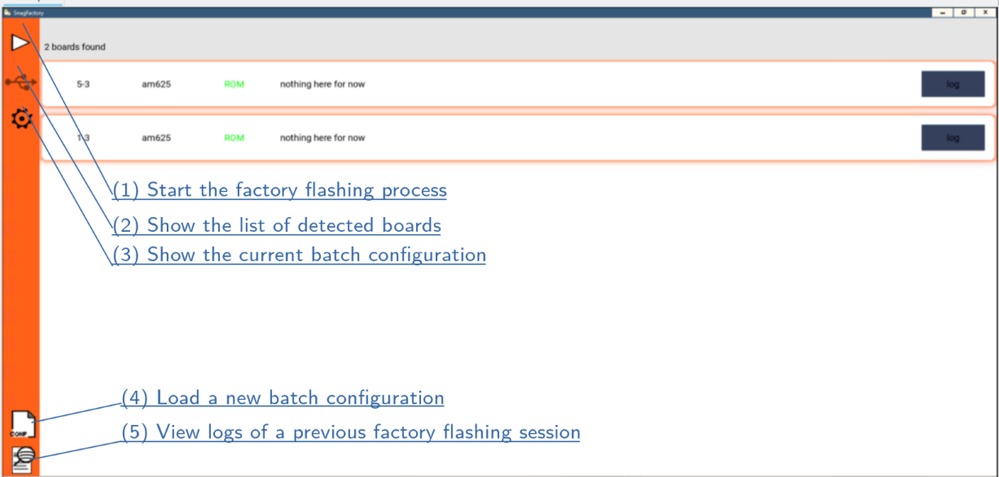

# Snagfactory

Snagfactory is a tool for simultaneous and efficient recovery and flashing of multiple embedded devices. It leverages the support range of Snagboot along with the multithreading capabilities of the host machine.

The tool currently supports MMC backends for flashing images (SD card or eMMC). It has been tested on AM625x and A64 SoCs.

There are four main steps involved in using Snagfactory:

1. Compile recovery images

2. Write a configuration file

3. Bind the libusb-win32 driver to your boards

4. Run Snagfactory

## Recovery images

To rescue the boards from ROM recovery mode and handle the flashing operations, a special set of U-Boot images are needed. Please refer to the [corresponding documentation](fw_binaries.md) for instructions on how to build working recovery images for your device. This should preferably be done on a Linux system.

Moreover, you should make sure that the following config options are enabled when compiling U-Boot:

```
• CONFIG_CMD_FASTBOOT
• CONFIG_FASTBOOT
• CONFIG_USB_FUNCTION_FASTBOOT
• CONFIG_FASTBOOT_FLASH
• CONFIG_FASTBOOT_UUU_SUPPORT
• CONFIG_FASTBOOT_FLASH_MMC
• CONFIG_FASTBOOT_OEM_RUN
• CONFIG_CMD_PART
• CONFIG_CMD_GPT
```

Additionally, you'll need to enable autoboot and set the default boot command to `fastboot usb 0`

Please use menuconfig to check that your configuration is coherent, as some of these settings depend on intermediate options, which won’t be apparent if you modify the .config file directly.

## Configuration file

Open the [example configuration file](snagfactory-example.yaml) provided by us. Here is a brief visual explanation of the structure of this file:

```yaml
boards:
 "0451:6165": "am625" --> scans for USB devices matching this vid:pid pair
 "1f3a:efe8": "a64"

soc-models:
 am625-firmware: --> this section specifies paths to recovery images
  tiboot3:
    path: "tiboot3_evm.bin"
  tispl:
    path: "tispl_evm.bin"
  u-boot:
    path: "u-boot_evm.img"

 am625-tasks:
   device-num: 0
   device-type: mmc

  partitions:  -> this section describes the GPT partition table to create
    - name: boot
      size: 3M
      bootable: True
    -
      name: rootfs
      size: 1000M
      image: "./rootfs.ext4" --> image to flash to the rootfs partition
      image-offset: 0

  boot0:
    name: mmc0boot1
    image: ...
    image-offset: ...

  fb_buffer_size: 0x7000000
```

You should only have to modify the paths to the recovery firmware and the partitions section. If you wish to flash a raw disk image on the entire device instead of a single partition, you can replace the partitions section by a simpler image section :

```yaml
 image: "./sdcard.img"
```

## libusb-win32

Power-up one of your boards in recovery mode and plug it into your host PC. Then, launch the Zadig app and find the USB device corresponding to your board. You might have to click on Options>‘List all devices’ to see it. Then, select the libusb-win32 driver and click on the install driver button.

⚠There is a bug in older libusb versions which confuses root hub numbers, preventing snagfactory from working properly. The fix to this bug is currently in a pending pull request on the libusb repository.

## Running the app



Firstly, you should load your configuration file. To do this, click on the load configuration button (4) and select your file. You can check that you loaded the correct configuration by clicking on the view configuration button (3).

Return to the main view by clicking on the board list button (2). Then, power up your boards in recover mode and plug them into your host PC. You should see a matching number of boards appearing in the Snagfactory UI. You may then click on the start button (1) to launch the factory flashing process.

During the factory flashing process, you may view detailed logs for any board by clicking on its « log » button.

Once the factory flashing process is finished, the UI will transition to « log view » mode. In this mode, you can view the final results and detailed session logs for each of the processed boards. These logs will also be stored in the Snagboot appdata directory. You can use the « view logs » button (5) to load the full logs of any previous session.


